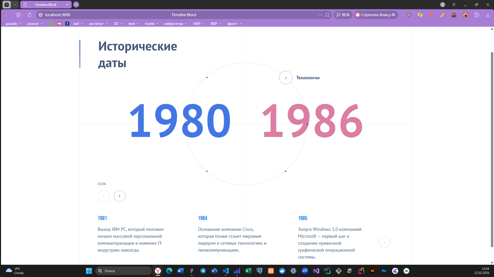
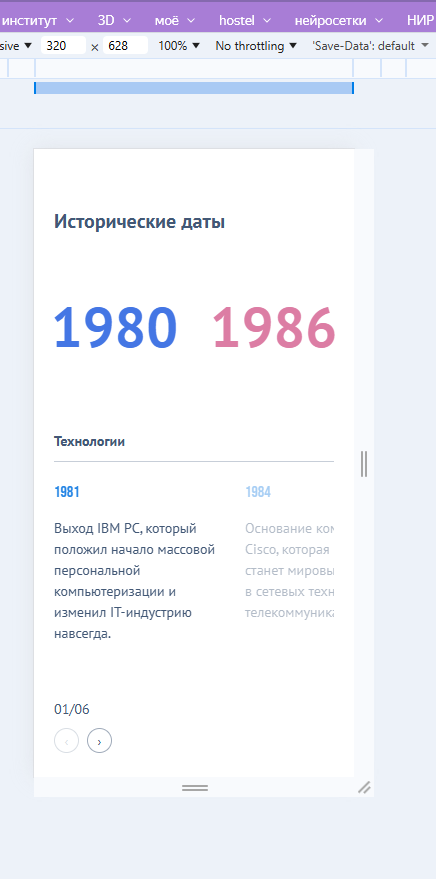

# 🕒 Timeline Block (Test Task)

Тестовое задание: реализация интерактивного блока временных периодов с событиями в соответствии с макетом.

## 📌 Описание проекта

Реализован независимый интерактивный блок, содержащий:

* 6 временных периодов
* события внутри каждого периода
* переключение периодов через точки, расположенные на окружности
* слайдер с подробной информацией по событиям активного периода
* анимации при смене периодов и слайдов

Блок полностью независим от остальной страницы — можно разместить несколько таких компонентов на одной странице без конфликтов логики и стилей.

---

## 🧩 Функциональность

* 🔵 Равномерное расположение интерактивных точек по окружности
* 🔄 Переключение активного периода
* 🔢 Динамическое изменение числовых значений периода
* 🎞 Обновление слайдера при смене периода
* 📱 Адаптивная верстка (mobile / desktop)
* ✨ Анимации с использованием GSAP
* ⬅➡ Кастомная навигация Swiper
* 📌 Отдельная кастомная пагинация для мобильной версии

---

## 🛠 Используемые технологии

* **TypeScript**
* **React**
* **SCSS**
* **Webpack**
* **Swiper** — для слайдера
* **GSAP** — для анимаций

---

## 🏗 Архитектура

Компонент разбит на независимые части:

* `TimelineBlock`
* `TimelineCircle`
* `TimelineSlider`
* `TimelineEventCard`
* `useTimeline` — кастомный хук управления состоянием

Каждый блок изолирован и не зависит от внешней логики страницы.

---

## 📐 Особенности реализации

* Все линии из макета реализованы как часть верстки
* Точки на окружности рассчитываются динамически
* Слайдер пересоздается при смене активного периода
* Анимации появления слайдов реализованы через GSAP
* Breakpoints Swiper настроены через min-width логику

---

## 🚀 Установка и запуск проекта

### 1️⃣ Клонировать репозиторий

```bash
git clone <repository-url>
cd <project-folder>
```

### 2️⃣ Установить зависимости

```bash
npm install
```

### 3️⃣ Запустить проект

```bash
npm run start
```

Проект будет доступен по адресу:

```
http://localhost:3000
```

---

## 📦 Сборка production-версии

```bash
npm run build
```

---

## 📂 Структура проекта FSD

```
src/
 ├── app/ -стили проекта и страница входа
 ├── widgets/ - отдельные компоненты
 │    └── TimelineBlock/
      └── TimelineSlider/
      └── TimelineCirle/
 ├── entities/
 │    └── TimelineEvent/ - сущности
 ├── shared/ - настройки и библиотеки
 └── features/
      └── useTimeline/ -хуки
```

---

## 📱 Демонстрация




---

## ✨ Автор

Тестовое задание выполнено в рамках отбора на позицию Frontend-разработчика Калмыкова Ариной.


